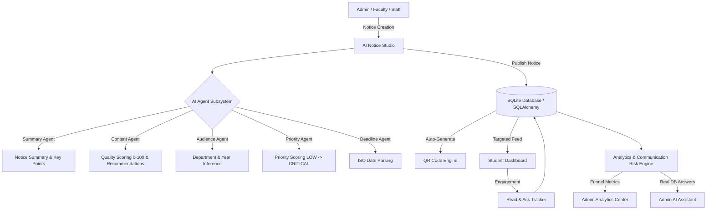

# CampusPulse AI 360 🚀
> **AI-Powered Campus Communication Assurance Platform**  
> *"Right Notice. Right Person. Right Time. Right Action."*


---

## 💡 Executive Summary & Core Innovation

Traditional campus notice boards measure **publication** — administrators publish a notice and assume students read it.  

**CampusPulse AI 360** redefines campus management by measuring **communication success**:

> **"Existing notice systems measure publication. CampusPulse measures communication success."**

By orchestrating an intelligent 11-step communication lifecycle:  
`CREATE → ANALYZE → UNDERSTAND → TARGET → PRIORITIZE → PUBLISH → REACH → READ → ACKNOWLEDGE → MEASURE → IMPROVE`

CampusPulse AI closes the communication loop. It detects unread notices, flags pending student acknowledgements, calculates real communication failure risks, and empowers administrators with actionable insights.

---

## 🏗️ System Architecture

CampusPulse AI is built as a **Modular Monolith** in Python + Flask, requiring zero paid dependencies, zero external Node/React complexity, and operating 100% locally with deterministic AI fallback intelligence.



---

## 🤖 Modular AI Agent Subsystem (`ai/`)

CampusPulse AI features 9 specialized AI agents:

| Agent | Module | Core Function |
| :--- | :--- | :--- |
| **Notice Intelligence** | `ai/summary_agent.py` | Extracts concise summaries, key points, required actions, and entities. |
| **Content Quality** | `ai/content_agent.py` | Evaluates completeness, scores quality (0-100), and provides improvement tips. |
| **Audience Intelligence** | `ai/audience_agent.py` | Infers target department, student academic year, and role. |
| **Priority Intelligence** | `ai/priority_agent.py` | Recommends notice priority (`LOW`, `MEDIUM`, `HIGH`, `URGENT`, `CRITICAL`). |
| **Deadline Intelligence** | `ai/deadline_agent.py` | Parses expressions (*today*, *tomorrow*, *next Friday*) into ISO dates. |
| **Communication Risk** | `ai/risk_agent.py` | Calculates real DB deficits (Targeted vs Viewed vs Read vs Acknowledged). |
| **Search Intelligence** | `ai/search_agent.py` | Interprets natural language search queries (*"placement notices before Friday"*). |
| **Admin AI Assistant** | `ai/admin_agent.py` | Terminal assistant answering administrative queries directly from SQLite data. |
| **Deterministic Fallback**| `ai/fallback_agent.py` | High-quality offline heuristic NLP engine for 100% local operation without API keys. |

---

## 📊 The Communication Funnel

CampusPulse tracks every notice through 4 measurable stages:

```
┌─────────────────────────────────────────────────────────┐
│ TARGETED STUDENTS (e.g. 420 CSE Final Year)              │
└──────────────────────────┬──────────────────────────────┘
                           │
                           ▼
┌─────────────────────────────────────────────────────────┐
│ VIEWED / OPENED (e.g. 381 Students - 90.7%)            │
└──────────────────────────┬──────────────────────────────┘
                           │
                           ▼
┌─────────────────────────────────────────────────────────┐
│ READ & VERIFIED (e.g. 352 Students - 83.8%)             │
└──────────────────────────┬──────────────────────────────┘
                           │
                           ▼
┌─────────────────────────────────────────────────────────┐
│ ACKNOWLEDGED (e.g. 294 Signed Off - 70.0%)               │
└─────────────────────────────────────────────────────────┘
```

---

## 🔒 Dual-Stage Security Architecture

1. **Role-Based Access Control (RBAC)**: Password hashing with Werkzeug, strict Flask session scoping.
2. **Dual-Stage Admin Verification**: When an Admin logs in, secondary key entry (`ADMIN_VERIFICATION_KEY=CP_ADMIN_2026_SECURE`) is required before unlocking admin routes.
3. **Privacy-Aware Data**: Students can only access their own engagement data; administrators see aggregated and authorized viewer rosters.

---

## ⚡ Quick Start Guide

### 1. Prerequisites
- Python 3.10+
- Git

### 2. Installation
```bash
git clone https://github.com/HARIESHPERIASAMY/campuspulse-ai.git
cd campuspulse-ai

# Create virtual environment
python -m venv venv
# Windows:
venv\Scripts\activate
# Linux/macOS:
source venv/bin/activate

# Install dependencies
pip install -r requirements.txt
```

### 3. Environment Configuration
Copy `.env.example` to `.env`:
```bash
cp .env.example .env
```
*(Optionally provide `AI_API_KEY` for Gemini API, or leave blank to run 100% locally with deterministic fallback intelligence)*

### 4. Synthetic Dataset Generation & Database Seeding
```bash
# Generate synthetic reproducible CSV dataset (200 notices, 1000+ engagement records)
python generate_dataset.py

# Seed SQLite database and pre-generate QR codes
python seed_data.py
```

### 5. Run Application
```bash
python app.py
```
Open your browser at `http://127.0.0.1:5000`.

---

## 🔑 Demo Credentials (`DEMO_CREDENTIALS.md`)

| Account Role | Email Address | Password | Secondary Admin Key |
| :--- | :--- | :--- | :--- |
| **Admin** | `admin@campuspulse.demo` | `Admin@123` | `CP_ADMIN_2026_SECURE` |
| **Student** | `student@campuspulse.demo` | `Student@123` | N/A |
| **Faculty** | `faculty@campuspulse.demo` | `Faculty@123` | N/A |
| **Staff** | `staff@campuspulse.demo` | `Staff@123` | N/A |

---

## 🧪 Automated Testing

Run the Pytest test suite:
```bash
pytest
```

---

## 📜 License & Acknowledgements

Built for serious national/college-level hackathons by the Greenfield Institute of Technology engineering initiative. Released under the MIT License.
